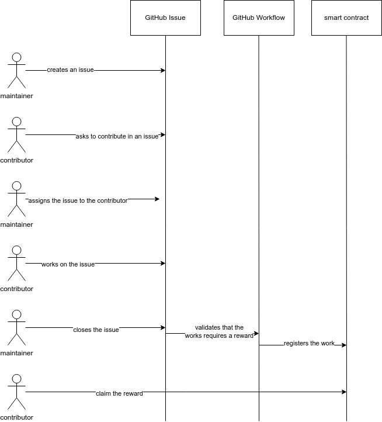
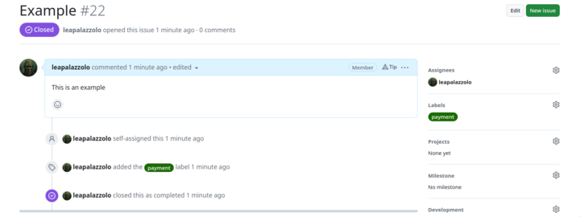
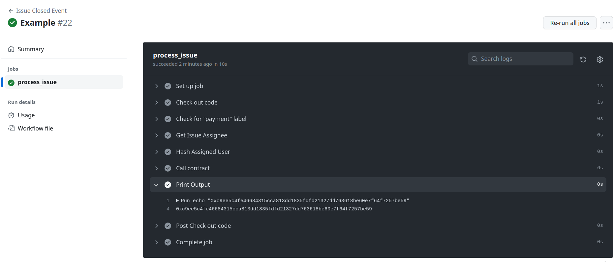

# Workflow example

This workflow will help you as an example when you want to integrate `Kudos ink!` in your repository. This workflow describes a simple case when the assignee of the issue will be "approved" to claim a reward in the smart contract as soon as the issue is closed. You can customize it and create more advanced workflows.

## Approve action

The workflow must include this custom GitHub Action that will call the **approve** method of the contract. More information about the action [here](https://github.com/kudos-ink/approve)

## Prerequisites

### Organization

1. Create your smart contract follow the guidelines from our [contracts repository](https://github.com/kudos-ink/contracts).
2. Deploy it and instantiate it.

### Contributors

1. Register yourself as a contributor in the smart contract provided by the organization you want to contribute using the method **registerIdentity**.

## Steps

1. Copy the [workflow](.github/workflows/issue-closed.yml) file in your repository.
2. Create these [configuration variables](https://docs.github.com/en/actions/learn-github-actions/variables#creating-configuration-variables-for-a-repository) in your repository:
  1. WS_PROVIDER_URL: the web-socket url of the parachain where the smart contract is placed
  2. CONTRACT_ADDRESS: the address of the contract
  3. ABI: the abi (JSON) of the contract
3. Create this [secret](https://docs.github.com/en/actions/security-guides/using-secrets-in-github-actions#creating-secrets-for-a-repository) in your repository:
  1. MNEMONIC_PHRASE: mnemonic phrase of the account used when the contract was instantiated.

## Usage

1. Create a new **Issue** with the label "payment".
2. Assign it to a contributor that wants to get a reward by solving the issue.
3. Close it when the work is done. This will trigger the workflow that will call the smart contract.
4. Optionally, check the workflow output.

## Example

### Issue closed

https://github.com/kudos-ink/workflow-example/issues/22

### Workflow triggered

https://github.com/kudos-ink/workflow-example/actions/runs/6685279925/job/18163413958

